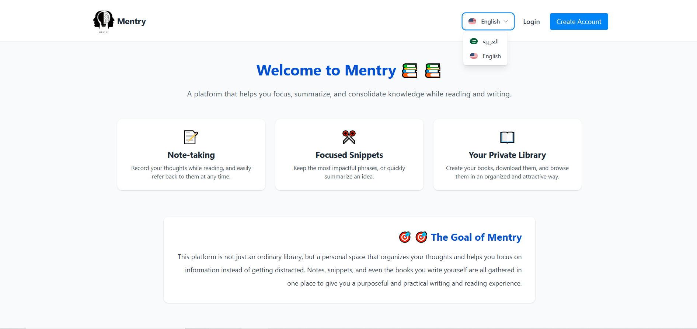

# 📘 Mentry - Personal Learning Dashboard


A self-managed learning & note-taking web application built with **Laravel**.  
Track your study books, write summaries, notes, highlights, and manage your reading time effectively.  
Supports **Arabic** and **English** with full REST API access.

---

## 🌟 Features

**Dashboard**
- ⏱️ Visual Countdown Timer with animated progress bar
- 📊 Stats: study books, written books, summaries, notes, highlights, available books

**Study Section**
- Add, view, download, and delete study books
- Upload **summaries** or **study sheets** (differentiated by type)
- Create and manage study notes linked to books
- Manage highlights (free-form)

**Reading Section**
- Access to the site’s public book library

**Writing Section**
- Create books in `.txt` format for editing later
- Export books to `.pdf` when finished
- Add notes linked to your books

**System**
- Role-based policies & permissions
- Logging for all important actions
- Admin panel (Filament) to manage library content
- REST APIs for all core features
- Localization: **Arabic** & **English**
- Modular service-based architecture (API logic fully separated)

---

## 🧰 Tech Stack
Laravel, Blade, MySQL/SQLite, Filament, REST API, Localization, Logging

---

## 📂 Project Structure

app/
Services/ → Business logic (API version fully separated)
Policies/ → Access control

resources/
views/ → Blade templates

routes/
web.php → Web routes
api.php → API routes

docs/
screenshots/ → Project images


---

## 📸 Screenshots
See `/docs/screenshots/` for:
- Dashboard
- Study book management
- Writing section
- Admin panel

---

## 🛠 Installation & Usage

**Requirements**
- PHP 8.2+
- Composer
- MySQL/SQLite

**Setup**
```bash
git clone https://github.com/faresnassar09/Mentry.git
cd Mentry
cp .env.example .env
# Fill DB_*, MAIL_* keys
composer install
php artisan key:generate
php artisan migrate
php artisan storage:link
php artisan serve

| Role  | Email          | Password |
| ----- | ---------------| -------- |
| User  | user@test.com  | 00000000 |
| Admin | admin@test.com | 00000000 |
